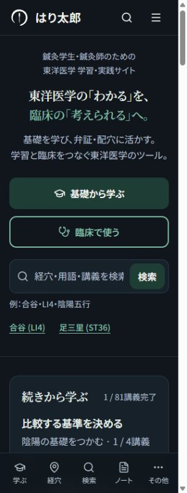
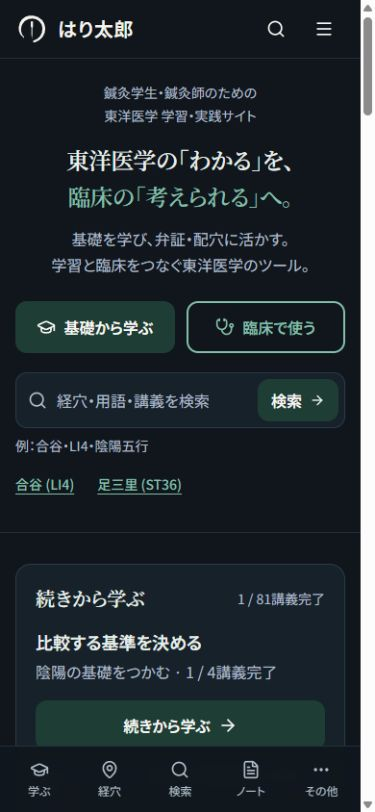

# スマホ表示改善・検証記録

検証日：2026年10月5日。対象は既存リポジトリのトップページと共通部品。公開サイトは [haritaro.jp](https://www.haritaro.jp/)。今回の表示確認はローカルの本番用ビルドで行い、本番への公開は未実施。

## 実装した内容

| 採用済み項目 | 実装 |
| --- | --- |
| 1 意味の区切りで改行 | 見出しの文節だけをまとめ、短い語尾を保持。本文は自然に折り返す。狭い幅・文字拡大では文節内の追加改行を許容。 |
| 2 上部ラベル | 指定の2つのまとまりに短縮。カプセル枠と星を除去。固定高さなし。 |
| 3 メインコピー | 指定文言を維持し、明朝・白／緑で表示。通常の4幅では前半／後半各1行。 |
| 4 紹介文 | 指定の2文へ置換。ヒーローは中央、カードの説明と本文は左揃え。 |
| 5 余白 | スマホの共通左右余白16px。入口、検索、カードを揃え、ヒーローの過大な高さをなくす。 |
| 6 入口 | 同じ高さ54px、角丸、20pxアイコン。375〜430pxは2列、320pxと拡大時は1列。遷移先を維持。 |
| 7 検索 | 指定プレースホルダーと入力ラベル・例を設定。合谷／足三里は小さなリンク。入力は縮み、送信操作は残る構造。 |
| 8 保存と固定ナビ | 浮いた保存ボタンの描画を撤去し「その他」に保存一覧と件数を追加。既存の保存機能・保存データ形式は維持。ナビ実測高さ＋セーフエリアに対応し、本文末尾とフォーカスの余白を確保。 |
| 9 情報整理 | 再開→6機能→両対象者の案内→コース→理論／弁証／配穴／記録→読みもの→更新／運営／出典の順。両対象者を常時表示。最新3件＋全件の更新一覧を追加。 |
| 10 共通表示 | 本文・操作はゴシック、主要見出しは明朝。補助文字と色、角丸、入力、可変高さを共通化。経穴、講義、ノート、検索、メニューの拡大時の配置も修正。 |

学習再開は既存の履歴・コース情報を参照する表示用処理を追加。履歴なし、未ログイン、履歴あり、取得失敗を分け、待機が長い場合は6秒で代替の入口を出す。既存の学習推奨ロジックは「復習・別の学び方」から使える状態を保った。

医学的な本文・推論処理、料金、認証、保存データの仕様は変更していない。講義の図のラベル移動・サイズ調整も、既存の説明と意味を保持している。

## 表示の確認結果

Codex内のChromiumで画面幅を変更。指定幅320／375／390／430pxにはデスクトップ用の縦スクロールバー15pxが含まれ、コンテンツ幅は305／360／375／415pxとなる。実機のSafari／Chromeとは描画・フォント・ブラウザUIの条件が異なる。

| 画面 | 通常表示・4幅 | 文字拡大・4幅 |
| --- | --- | --- |
| トップ | ページ全体の横スクロールなし | 同左。入口・機能は必要に応じ1列 |
| 合谷の経穴詳細 | 横スクロールなし | 同左。ボタン・前後の経穴リンクを折り返す |
| 陰陽論 第1講 | 横スクロールなし | 同左。図・操作・クイズ補助表示を調整 |
| 臨床ノート | 横スクロールなし | 同左。作成／編集／保存済みカードを確認 |
| 学習ノート | 横スクロールなし | 同左。入力・保存後も確認 |

上記40通りすべてでページ幅の計測が合格。既存の経過比較表は表内で横スクロールし、ページ全体を押し広げない。

文字拡大は、別のローカル検証用ポートでルートの文字サイズを200%（スマホ16px→32px）にする方式。ピンチズームやOSの文字拡大設定とは別の確認であり、固定pxの図内文字まで一律2倍になる試験ではない。

通常のメインコピーは4幅とも2行。入口は同じ幅・高さで、検索と共通の左端に揃う。フォント配信を遮断した代替フォントの表示でも4幅で改行と横はみ出しを確認した。

740×320pxの横向きで通常／文字拡大の検索、その他、メニュー編集、保存一覧を確認。短い画面ではパネル全体をスクロールし、下の操作へ到達できる。320px・文字拡大時のメニュー編集には内部の横はみ出しもない。

下部ナビは通常69px、末尾の余白85px。拡大時はナビの実測高さに追従し、40通りすべてで末尾余白がナビ高さを上回った。390pxでページ末尾へ移動し、フッター末尾がナビ上端より約16px上にあることを確認。

PCの1280×900pxでトップ、経穴詳細、講義、ノートにページ全体の横スクロールなし。主要ナビと本文幅も確認。

## 操作と状態の確認

- 「基礎から学ぶ」「臨床で使う」が既存の学習／臨床ページへ遷移。
- トップにLI4を入力して送信。検索パネルへの受け渡し、候補クリック、矢印キー＋Enterの候補選択を確認。
- 下部ナビから検索し、入力・候補・Escape終了・起点へのフォーカス復帰を確認。
- 合谷の個別保存を行い、「その他」→保存一覧で合谷（LI4）を確認。既存の保存状態は再読み込み後も表示。
- 架空ID「UI-TEST-001」の臨床ノートを拡大表示で作成・保存し、再読み込み後も記録を確認。学習ノートも架空の文章で入力・保存・再読み込みを確認。
- 講義第1講を受講済みにしてトップへ戻ると1／81完了を表示。再開ボタンから第2講へ進み、コース情報が維持される。
- 履歴なし／履歴あり／保存領域の取得失敗を検証用の架空データで確認。失敗時は「確認中」が続かず、説明、入門コース、再読み込み操作を表示。
- 初期の短い読み込み表示から、操作可能な履歴表示へ切り替わることを確認。
- 更新情報はトップ3件、全件の一覧16件へ到達。運営者・出典・安全性の入口を維持。
- メニュー編集を保存して適用でき、既存の4枠設定と固定「その他」の構成を維持。

## コントラストと既存チェック

通常文字の4.5:1を目安に確認した主要な組み合わせ：

| 文字色／背景色 | 比率 |
| --- | --- |
| 補助文字 #59615D／#FCFAF6 | 6.12:1 |
| 緑 #184F49／#FCFAF6 | 8.94:1 |
| 暗色の補助文字 #AFBDC8／#17212A | 8.49:1 |
| 暗色の緑 #83BEA8／#17212A | 7.69:1 |
| 補助の茶色 #975319／#FCF4EB | 5.40:1 |
| 図の赤文字 #A83629／#FCF4EB | 5.98:1 |

本番用ビルドと型チェックが成功し、540ページを生成。`test:site`（再開処理の回帰確認を追加）、`test:learning`、`test:sync`、`test:reading`、`test:content`、`test:medical-safety`、臨床ワークフローの既存チェックが合格。変更対象のESLintはエラー0、差分の空白チェックも合格。

変更対象に元からある未使用変数・画像タグの警告は残る。未変更の `HomeWelcomeGuide.tsx` には既存のeffect内setStateに関するlintエラーがあり、リポジトリ全体のlintが完全に解消されたとはしていない。

## スクリーンショット・確認の限界

追加の計測JSON、PC、フッター、文字拡大時の画像は、ワークスペースの `audits/2026-10-05/mobile/` に保存。`final-verification.json` が40通りの最終計測。`checks-during-implementation.json` は修正前の不具合を含む作業中の記録。

実機のiOS／Android、ブラウザ上下UIの伸縮、ソフトウェアキーボード、ノッチのセーフエリア、ピンチズームは未確認。これらに対応するCSSと可視領域の処理は実装済みだが、短いビューポートのエミュレーションを実機確認の代わりとして扱っていない。実アカウントでのクラウド履歴もブラウザでは未確認（既存の同期・分離・オフライン処理の回帰チェックは合格）。

IMG_6807.png／IMG_6808.pngは取得できなかった。公開トップの不自然なラベル改行は確認したが、参照2画像の表示差の原因を確定したとはしていない。

## 再確認の方法

標準の `npm run build` と `npm run start -- --port 3043` で変更した本番用表示を確認できる。検証用の `scripts/mobile-preview-fixtures.mjs` は127.0.0.1だけで起動し、本番には組み込まれない。

例：`node scripts/mobile-preview-fixtures.mjs http://localhost:3043 3044`。検証側のURLに `?text=200` または `?ui-test=empty`／`history`／`failure` を指定する。フォント未読み込み相当は末尾の起動引数 `block-fonts` を使用。架空履歴の検証は通常表示のポートと分離している。
